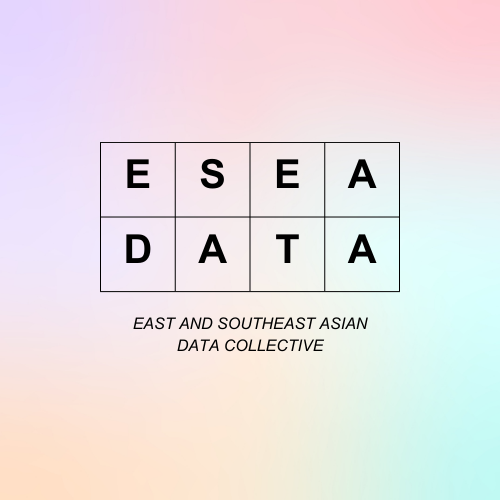

# East and Southeast Asian (ESEA) Data Collective

The East and Southeast Asian (ESEA) Data Collective is an initiative to gather and analyse data on issues affecting ESEA people in the UK.

It grew out of a collaboration on hate crime data with [End Violence and Racism Against East and Southeast Asian Communities (EVR ESEA)](https://evresea.com/), [Voice ESEA](https://www.voiceesea.com/) and [King's College London](https://publicdatalab.org/).

## Data on hate crime reporting

### 2019-2020 

* [Data compiled by EVR ESEA](https://web.archive.org/web/20211009001117/https://evresea.com/data), [EVR ESEA press release](https://static1.squarespace.com/static/5ec3f54599dedd7547fa4508/t/61615e330a00fb64019784c0/1633771060975/EVR+Press+statement+for+FOI+Hate+crime+data+initiative+9+Oct+21.pdf) and media coverage from [ITV News](https://twitter.com/itvnews/status/1445822729907630080), [ITV London](https://twitter.com/itvlondon/status/1446064102388928514?s=20) and [ITV News Anglia](https://twitter.com/itvanglia/status/1446117980077649922?s=20)
* [Data compiled by Voice ESEA](https://www.voiceesea.com/police-data-map) and [interview on Resonate](https://www.weareresonate.com/2021/08/interview-voice-esea-team-talks-collecting-uk-hate-crime-data-and-combating-racism/)
